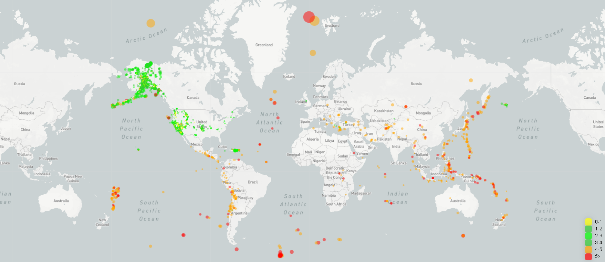
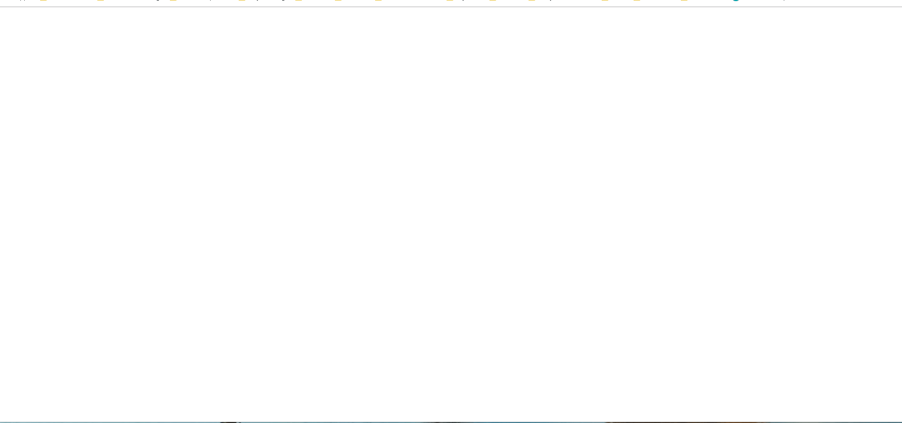

# leaflet-challenge
Geo-mapping project using leaflet.

## Background

Welcome to the United States Geological Survey, or USGS for short! The USGS is responsible for providing scientific data about natural hazards, the health of our ecosystems and environment; and the impacts of climate and land-use change. Their scientists develop new methods and tools to supply timely, relevant, and useful information about the Earth and its processes. As a new hire, you will be helping them out with an exciting new project!

The USGS is interested in building a new set of tools that will allow them visualize their earthquake data. They collect a massive amount of data from all over the world each day, but they lack a meaningful way of displaying it. Their hope is that being able to visualize their data will allow them to better educate the public and other government organizations (and hopefully secure more funding..) on issues facing our planet.

## Tasks Completed

1. **Data set**

   

   The USGS provides earthquake data in a number of different formats, updated every 5 minutes. From the [USGS GeoJSON Feed](http://earthquake.usgs.gov/earthquakes/feed/v1.0/geojson.php) page and I have selected dataset for past 1 month earthquake data to visualize in this project.

   

2. **Import & Visualize the Data**

### Level 1: Basic Visualization

### Level 2: More Data (Optional)

In this, I have added a [platonic data set from USGS](https://github.com/fraxen/tectonicplates) on the previous map to illustrate the relationship between tectonic plates and seismic activity.

Also following additional features have been added:

- BaseMaps [ Satellite, GrayScale, Outdoors]

- OverLay maps [ Tectonic Plate lines, Earthquakes ]

- - -

### Copyright

Trilogy Education Services © 2019. All Rights Reserved.
